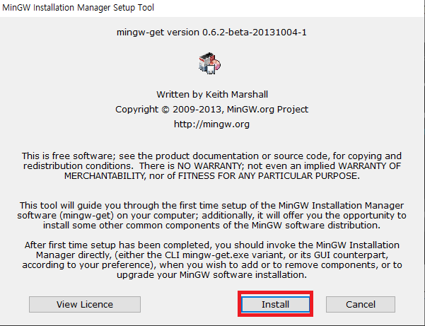
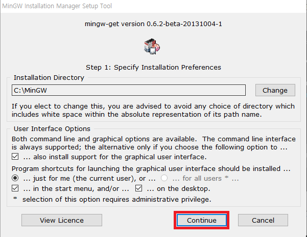
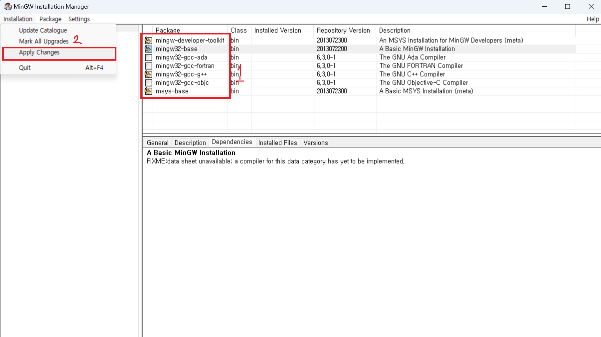
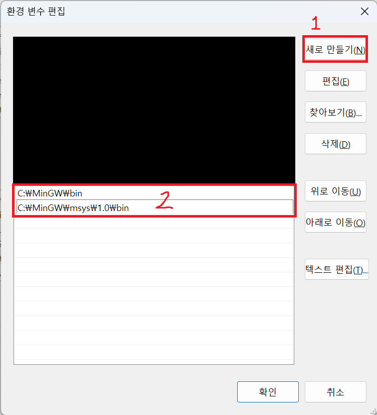
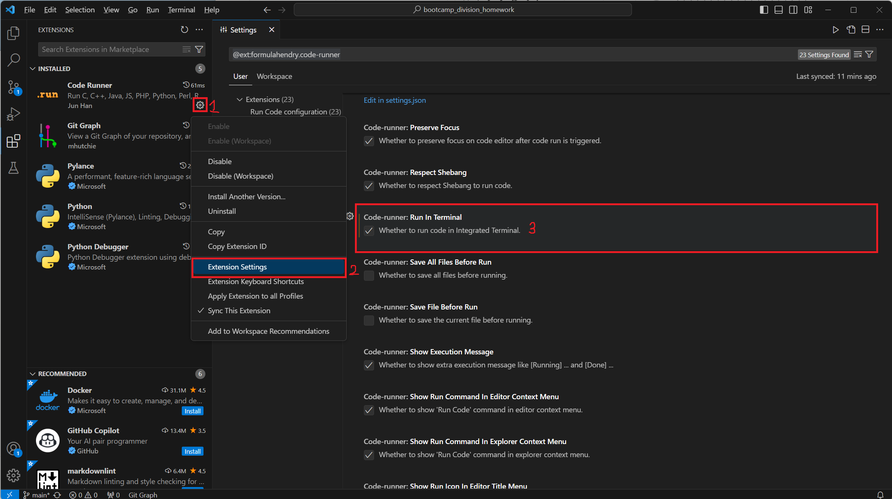

# 2025_Haedal_Bootcamp_C
<h4> [시간] 화, 목 19:00 ~ 20:00 </h4>
<h4> [장소] it1호관 116호 </h4>

# 업로드 방법
### 파일명
- **폴더**는 week1, week2, ... , week8 으로 구성되어 있습니다.
- 각자 해결한 과제 파일을 해당 주차의 폴더에 업로드 해주세요.

- **파일명**은 "주차 번호_과제 번호.c"입니다.
- 예시 : 1주차 과제 1번 -> 1_1.c, 2주차 과제 2번 -> 2_1.c

# 최초 사용
- 본인의 컴퓨터에서 "Git Bash"를 실행합니다.
- `git clone "https://github.com/seongwon02/2025_Haedal_Bootcamp_C.git"`을 입력하여 저장소를 복제합니다.
- 복제가 완료되면 본인의 이름으로 된 폴더를 찾아 들어갑니다.
- 본인의 이름으로 된 폴더 안에 자신의 코드를 업로드 합니다.
- 업로드가 완료되면 `git add .` -> `git commit -m "message"` -> `git push origin main`를 통해 업로드 합니다.

# C 설정
## [1] GCC 설치
### 1. Windows인 경우
(주의) 폴더 경로에 한글이 있으면 안됩니다. 만약 user가 한글로 되어있다면 이름 영어로 변경하셔야 합니다.

1. [MinGW](https://sourceforge.net/projects/mingw/) 사이트 접속 후 `Download` 버튼을 클릭합니다.

   

1. `Install` - `Continue` 버튼을 클릭합니다.

   

   

   

1. MinGW 설치가 끝나면 아래와 같이 체크한 뒤 `Installation` - `Apply Changes` 를 클릭합니다.

   - mingw-developer-toolkit
   - mingw32-base
   - mingw32-gcc-g++
   - msys-base

   

1. `Apply` 버튼을 클릭해 설치합니다.

   

1. `시스템 환경 변수 편집`을 검색해줍니다.

   > [!WARNING]
   >
   > 띄어쓰기에 주의해주세요.

   

1. `환경 변수(N)...` 버튼을 클릭합니다.

   

1. 시스템 변수에서 변수 `Path`를 찾아 클릭한 뒤, `편집` 버튼을 클릭합니다.

   

1. `새로 만들기` 버튼을 클릭해 아래 2개의 값을 추가해줍니다.

    ```
    C:\MinGW\bin
    C:\MinGW\msys\1.0\bin
    ```

   

1. 확인을 눌러 저장한 뒤, `git bash`를 열어 아래의 명령어를 입력해봅니다.

    ```bash
    gcc -v
    ```

   

   사진과 비슷하게 뜬다면 성공입니다.

### 2. macOS인 경우

1. `Terminal`에 아래의 명령어를 입력합니다.

    ```
    xcode-select --install
    ```
## [2] Code Runner

1. `Extension` 탭에서 `Code Runner`를 설치합니다.

   
2. `Extension` 탭에서 Code Runner 우측 하단 톱니바퀴를 클릭 - `Extension Settings`을 클릭합니다.

   우측 설정창에서 `Run In Terminal`을 찾아 체크합니다.

   

3. `Terminal Root` 를 찾아 `/`를 입력합니다.

   
   
## [3] C/C++

1. `Extension` 탭에서 `C/C++`를 설치합니다.

   
